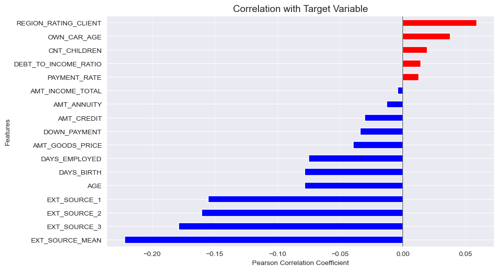

# 💰 Análise e Predição de Risco de Crédito

[](README.md)
[](README_pt.md)

> *For the English version, click the button above.*

---


## 📋 Contexto do Negócio
A inadimplência é um dos maiores riscos para instituições financeiras. O objetivo deste projeto é utilizar dados históricos de solicitações de crédito para identificar padrões de comportamento e prever a probabilidade de um cliente não honrar seus pagamentos (Variável `TARGET`: 0 = Pagador, 1 = Inadimplente).

O foco não é apenas prever o risco, mas **entender os drivers** que levam ao calote, permitindo estratégias de concessão de crédito mais assertivas.

---

## 🛠️ Estratégia da Solução (Pipeline)

O projeto segue a metodologia **CRISP-DM**, dividido em 3 etapas estratégicas de análise antes da modelagem:

### 1. Data Understanding & Sanity Check
Diagnóstico inicial da saúde dos dados.
* **Desbalanceamento:** Identificado que apenas **8.07%** da base consiste em inadimplentes (classe minoritária).
* **Qualidade dos Dados:** Detecção de colunas com >50% de nulos (`OWN_CAR_AGE`, `EXT_SOURCE_1`) e multicolinearidade severa entre `AMT_CREDIT` e `AMT_GOODS_PRICE`.

### 2. Data Preparation & Cleaning
Tratamento robusto para garantir a integridade da modelagem.
* **Correção de Anomalias:** Tratamento da variável `DAYS_EMPLOYED`, onde 365.243 dias (1000 anos) representavam erros ou aposentados.
* **Imputação Inteligente:** Preenchimento de valores nulos em Renda e Anuidades usando a mediana para evitar distorções por outliers.
* **Categorização:** Criação da categoria `Unknown` para profissões não informadas, preservando a informação da omissão.

### 3. Feature Engineering & EDA
Criação de novas variáveis e validação de hipóteses de negócio.
* **Criação de Features:**
    * `EXT_SOURCE_MEAN`: Média dos scores de bureaux externos (Serasa/SPC equivalentes).
    * `DEBT_TO_INCOME_RATIO`: Comprometimento da renda com o empréstimo.
    * `AGE`: Conversão de dias para anos.

---

## 📊 Principais Insights de Negócio

Durante a Análise Exploratória (EDA), testamos 5 grandes hipóteses. Os resultados direcionaram a seleção de variáveis para o modelo:

### 1. Histórico > Capacidade Momentânea
A variável mais forte do dataset não é a renda, mas o histórico. A **Média dos Scores Externos (`EXT_SOURCE_MEAN`)** provou ser o "Santo Graal" da predição, mostrando uma separação nítida entre bons e maus pagadores.

> *Insight:* Clientes com score externo baixo são riscos iminentes, independente da renda declarada.

### 2. O Fator Maturidade
Confirmamos a hipótese de que **jovens (< 30 anos)** possuem risco significativamente maior. A curva de inadimplência decresce linearmente conforme a idade avança.

### 3. Educação como Escudo
A escolaridade mostrou forte correlação negativa com o risco. Clientes com **Ensino Superior** têm taxas de default drasticamente menores que aqueles com apenas Ensino Médio ou Inferior.

---

## 📉 Top Drivers de Risco (Ranking de Correlação)

Após a engenharia de atributos, identificamos quais variáveis mais impactam a decisão de crédito:

| Variável | Impacto | Descrição |
| :--- | :--- | :--- |
| **`EXT_SOURCE_MEAN`** | 📉 Proteção | Quanto maior o score, menor o risco (Correlação Negativa Forte). |
| **`AGE`** | 📉 Proteção | Clientes mais velhos são mais seguros. |
| **`REGION_RATING`** | 📈 Risco | Moradores de regiões com baixo rating comercial tendem a inadimplir mais. |
| **`DAYS_EMPLOYED`** | 📉 Proteção | Estabilidade no emprego reduz o risco. |



---

## 🚀 Conclusão e Próximos Passos

A análise concluiu que o perfil de **Baixo Risco** é composto por clientes mais velhos, com ensino superior, estabilidade no emprego e bom histórico externo. Curiosamente, o comprometimento de renda (`DEBT_TO_INCOME`) teve impacto menor que o esperado, sugerindo que o *comportamento* (Character) pesa mais que a *capacidade* (Capacity) neste dataset.

**Próximos Passos:**
1.  **Modelagem (Notebook 04):** Treinamento de algoritmos baseados em árvores (Random Forest / XGBoost) devido à não-linearidade identificada nas features.
2.  **Otimização de Hiperparâmetros:** Focar na métrica **ROC-AUC** devido ao desbalanceamento das classes.

---

## 📁 Estrutura do Projeto

```bash
├── data
│   ├── raw                 # Dados originais
│   ├── processed           # Dados limpos (df_cleaned.csv)
├── notebooks
│   ├── 01_Data_Understanding.ipynb
│   ├── 02_Data_Preparation.ipynb
│   ├── 03_EDA_Business_Insights.ipynb
├── README.md